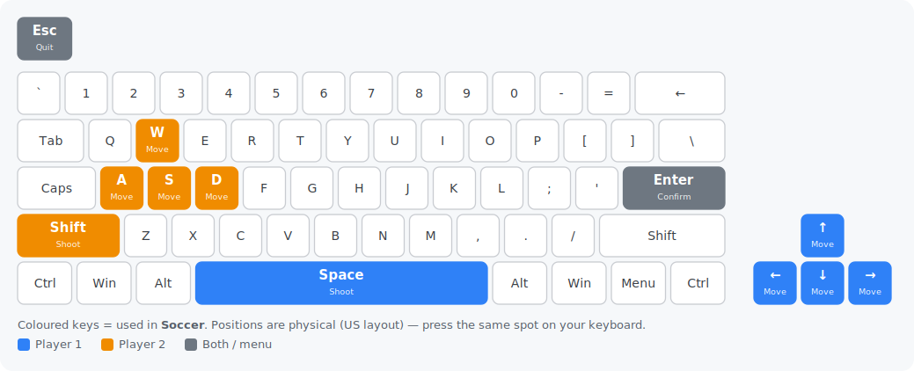

# Substitute Soccer — Go port

[](https://github.com/chrplr/soccer-go/releases/latest)

**▶ Play it in your browser: <https://chrplr.github.io/soccer-go/>**

A Go re-implementation of the Pygame Zero game **Substitute Soccer** from *Code the Classics
Volume 1* (Raspberry Pi Press), built on
[go-sdl3](https://github.com/Zyko0/go-sdl3) and the
[pgzgo](https://github.com/chrplr/pgzgo) harness.

All images, sounds and music are embedded, so `go build` produces a single
self-contained binary that needs no asset files at run time.

## Controls

One or two players. Keyboard only.

**Menu:** **Up** / **Down** change the highlighted option (number of players, then difficulty); **Space** / **Enter** confirms.

| Action | Player 1 | Player 2 |
|--------|----------|----------|
| Move   | Arrow keys | W / A / S / D |
| Shoot / pass | Space | Left Shift |

Press **Esc** to quit.

**Playing on a non-US keyboard?** The game reads *physical key positions* (US QWERTY layout), not the printed letters — so on an AZERTY or QWERTZ keyboard a labelled key may sit somewhere else. This matters most for Player 2's `W A S D` keys. Find each key on the picture below and press the same spot on your own board.



## How to play

**The goal.** It's football (soccer). Put the ball in the opponent's goal more often than they put it in yours. **First team to 9 goals wins.** After each goal the game restarts from a kickoff.

**Getting started.** From the menu, pick **1 player** (against the computer, then choose a difficulty) or **2 players** (head-to-head). Confirm with **Space** / **Enter** and the match kicks off.

**You only control one player at a time.** Your team has several players on the pitch, but you steer just one — the one marked by the coloured **arrow** floating above his head. The rest of the team is run by the AI, moving into space and defending automatically.

**With the ball.** When your player is near the ball he picks it up and dribbles it automatically — just steer him with your movement keys. Run toward the opponent's goal to attack.

**Shoot and pass.** Tap your **shoot/pass key** (Space for Player 1, Left Shift for Player 2) to kick. The kick is aimed for you: if a team-mate or the goal is ahead of you and roughly in the direction you're facing, the ball is passed/shot toward it; otherwise it's booted straight ahead. So *face the direction you want to kick* before pressing the key.

**Without the ball.** Pressing the same shoot/pass key switches your control to whichever team-mate is best placed near the ball — use it to grab back possession or to take over the defender closest to an attacker. To tackle, just run your controlled player into the ball carrier to knock the ball loose, then run over the loose ball to collect it.

**Winning tips.** Keep switching to the player nearest the ball, line up your facing direction before shooting, and use quick passes to move the ball up-field faster than a single dribbler can.

## Download

Prebuilt, self-contained binaries — no install, no dependencies, assets embedded.
Grab the latest for your platform:

- **Linux** (amd64) — [soccer-linux-amd64.tar.gz](https://github.com/chrplr/soccer-go/releases/latest/download/soccer-linux-amd64.tar.gz)
- **macOS** (Apple Silicon) — [soccer-macos-arm64.tar.gz](https://github.com/chrplr/soccer-go/releases/latest/download/soccer-macos-arm64.tar.gz)
- **Windows** (amd64) — [soccer-windows-amd64.zip](https://github.com/chrplr/soccer-go/releases/latest/download/soccer-windows-amd64.zip)

All versions are on the [releases page](https://github.com/chrplr/soccer-go/releases).

## Run

```sh
go run .
```

go-sdl3 bundles the SDL3, SDL3_image and SDL3_mixer libraries and extracts them at
startup, so no system SDL install is needed.

## Provenance & license

Ported to Go from the Python original in *Code the Classics Volume 1*. The game
design and original assets are © their respective authors / Raspberry Pi Press.

The original Python code and assets are in Raspberry Pi Press's [Code the Classics — Volume 1](https://github.com/raspberrypipress/Code-the-Classics-Vol1) repository.

The Go source code of this port is distributed under the MIT License.

See `Python_and_Go_implementation_comparison.md` for a walkthrough of how the port
maps onto the original.
